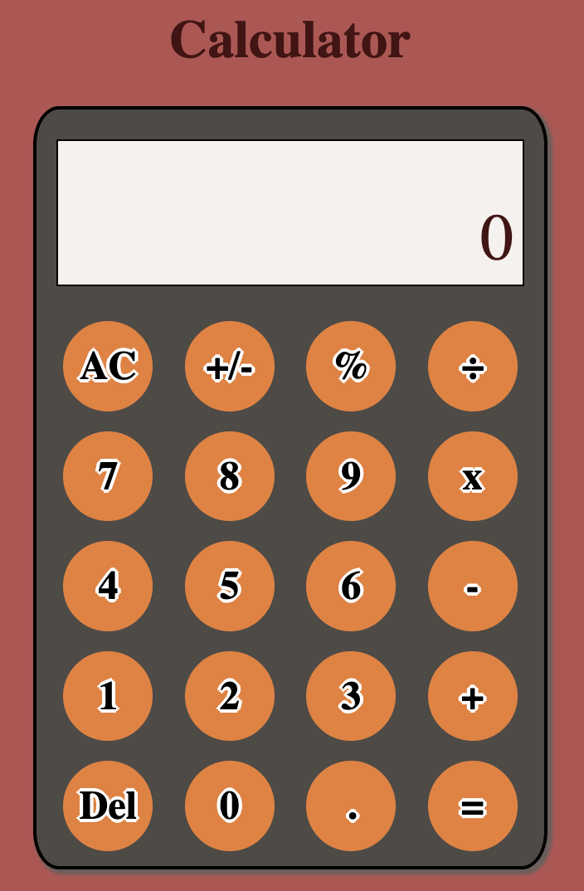

## Odin Calculator

A browser-based basic calculator built with HTML, CSS, and vanilla JavaScript. Supports chained operations, keyboard input, and subtle UI feedback sounds.

### Live Demo
- **GitHub Pages**: https://shawn2093.github.io/odin-calculator/

### Screenshot


### Features
- **Core operations**: addition, subtraction, multiplication, division
- **Utility keys**: AC (clear), Del (backspace), percent, +/- (toggle sign), decimal
- **Chained calculations**: keep operating without pressing equals every time
- **Keyboard support** with visual key highlighting
- **Subtle sound feedback** on button press (can be muted at the system level)
- **Responsive layout** for small screens

### What I Practiced
- **DOM manipulation**: updating the display and handling button states
- **Event handling**: click events and global keyboard listeners with shortcuts
- **State management**: tracking current operation, operands, and chaining
- **Floating point handling**: rounding to reduce precision errors
- **Responsive UI**: layout and styling with flexible sizing
- **Media APIs**: basic audio feedback using `Audio`

### Keyboard Shortcuts
| Key / Combo | Action |
| --- | --- |
| 0-9 | Enter digits |
| . | Decimal point |
| + - * / | Operators (× is `*`, ÷ is `/`) |
| Enter | Equals (=) |
| Escape | AC (clear all) |
| Backspace / Delete | Del (backspace) |
| Ctrl + 5 | Percent (%) |
| Shift + - | Toggle sign (+/-) |

### How It Works (Brief)
- The current operation is tracked as a string ending with the chosen operator.
- When a new operator is pressed, the previous operation is evaluated and the result becomes the new left operand.
- Numbers are rounded to avoid common floating-point imprecision.

### Run Locally
1. Clone the repository
   ```bash
   git clone https://github.com/shawn2093/odin-calculator.git
   cd odin-calculator
   ```
2. Open `index.html` in your browser
   - Double-click `index.html`, or
   - Serve the folder with any static server
     ```bash
     python3 -m http.server 5500
     # then open http://localhost:5500
     ```

### Project Structure
- `index.html`: Markup and button grid
- `style.css`: Layout, colors, and button styles
- `index.js`: Calculator logic, event handling, keyboard support, and sounds
- `tink.wav`: Click sound effect
- `calculator.png`: Screenshot used in this README

### Acknowledgments
- Built as part of **The Odin Project** curriculum
- Icons in the footer are inline SVGs

### Notes
- Sound playback depends on browser autoplay policies; first interaction may be required.
- Division by zero returns `Infinity` (browser default numeric behavior).

## 📄 License
This project is part of The Odin Project curriculum and is for educational purposes.

## 🤝 Contributing
This is an educational project, but suggestions and improvements are welcome via issues or PRs.

## 📞 Contact
Created by **Shawn Ong** ([@shawn2093](https://github.com/shawn2093)).

---
*Built with ❤️ using HTML, CSS, and JavaScript.*
